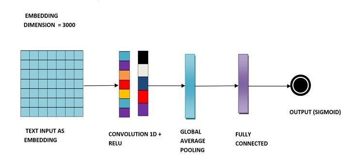

# Detection-of-Sensitive-Data-Exposure-in-Images
**Machine Learning Model** that is deployed as a **Web Application** which can be used by any individual or company to detect if their images contains sensitive data or not, thereby protecting the exposure or loss of private and sensitive information.

## Web Application - [Sensitivity Detecto](https://sensitivity-detecto.web.app)

## Abstract
In the current age of smart devices and smart phones, any image taken using these devices are immediately auto uploaded to the cloud (Google Photos, iCloud, etc) or internet (Social media sites like Facebook, Twitter, etc). And there is an archive of all the contents that is being uploaded to the internet in the [Wayback Machine](https://web.archive.org/). So, one must be cautious about what is being uploaded to the internet. 

Unfortunately, people knowingly or unknowingly upload images containing **sensitive data** like:
- Usernames and Passwords
- Credit card or Payment Card Information (PCI)
- Personally Identifiable Information (PII)
    - E-mail Addresses
    - Phone Numbers
    - Social Security Numbers
    - Aadhar Numbers
- Protected Health Information (PHI)
- Customer’s data
- Student’s data

All these sensitive information fall under three categories:
- Personal and Private Information
- Confidential Business Information
- Classified Information

Loss, misuse, modification, or unauthorized access to **sensitive information** can adversely affect the privacy or welfare of an individual, trade secrets of a business or even the security and international relations of a nation depending on the level of sensitivity and nature of the information. So, we have designed a **machine learning system** that classifies the data in the images as **sensitive or non-sensitive**. On being classified as sensitive, we can warn the users that their image contains sensitive information (before uploading to the cloud).

## Project Architecture

- The input image is fed into the **Convolutional Neural Network** for image classification. 
- The text in the images will be extracted using Tesseract OCR. The extracted text will be classified using **Convolutional Neural Networks and Logistic Regression**. 
- Finally, the output of the image classification and text classification will be fused together to produce the final output. 
- The final output tells us whether the information in the image is **Sensitive (or) Non-sensitive**.

## Image Classification Model

## Text Classification Model

### Note
This project is done by a team of 5 students as a part of Innovation Practices Lab. 
